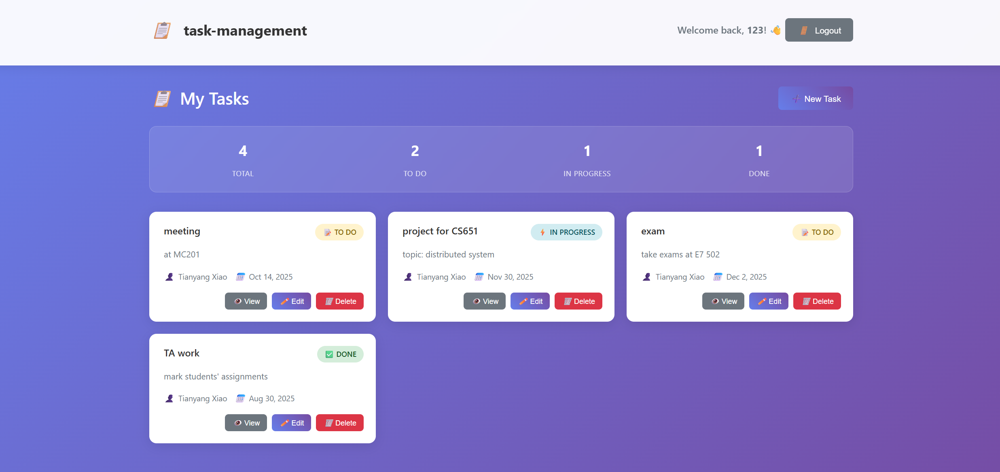
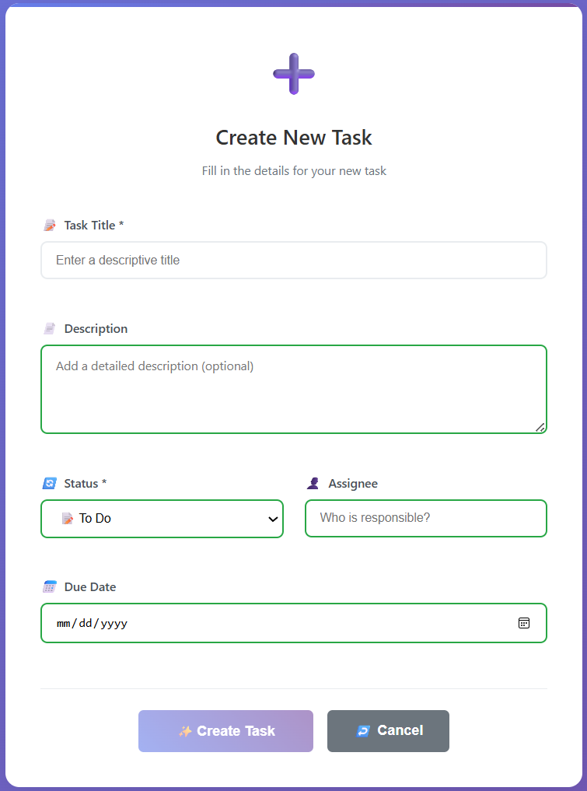
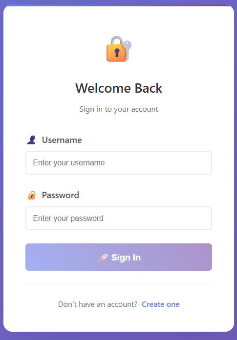

# Task Management System

A modern, full-stack task management application built with Angular and Node.js, featuring user authentication, real-time data management, and responsive design.

## 🚀 Live Demo

- **Frontend**: [https://task-management-drab-one.vercel.app/login](https://task-management-drab-one.vercel.app/login)
- **Backend API**: [https://taskmanagement-zzum.onrender.com](https://taskmanagement-zzum.onrender.com)

## 📋 Project Overview

This project demonstrates a complete full-stack web application with modern development practices, including:

- **Frontend**: Angular 20+ with standalone components and SSR
- **Backend**: Node.js/Express REST API with JWT authentication
- **Database**: MongoDB with Mongoose ODM
- **Deployment**: Vercel (frontend) + Render (backend)
- **CI/CD**: Automated deployment with GitHub Actions

## ✨ Key Features

### 🔐 Authentication & Security
- User registration and login with JWT tokens
- Password hashing with bcrypt
- Protected routes with Angular guards
- HTTP interceptors for automatic token management
- User session persistence

### 📊 Task Management
- Create, read, update, and delete tasks
- Task status tracking (Todo, In Progress, Done)
- Due date management with date picker
- Task assignment to users
- Real-time task statistics dashboard
- User-specific data isolation

### 🎨 Modern UI/UX
- Responsive design for all screen sizes
- Material Design-inspired interface
- Smooth animations and transitions
- Loading states and error handling
- Form validation with visual feedback
- Dark theme with gradient backgrounds

### 🏗️ Technical Architecture
- Component-based architecture with Angular standalone components
- RESTful API design with proper HTTP status codes
- MongoDB data modeling with relationships
- Client-side routing with lazy loading
- Server-side rendering (SSR) for SEO optimization
- Environment-based configuration

## 🛠️ Technology Stack

### Frontend
- **Framework**: Angular 20.3.2
- **Language**: TypeScript 5.7
- **Styling**: SCSS with custom CSS Grid/Flexbox
- **Build Tool**: Angular CLI with Webpack
- **State Management**: Angular Signals
- **HTTP Client**: Angular HttpClient with RxJS
- **Routing**: Angular Router with guards
- **Forms**: Template-driven forms with validation

### Backend
- **Runtime**: Node.js 20+
- **Framework**: Express.js 4.x
- **Database**: MongoDB with Mongoose ODM
- **Authentication**: JWT (JSON Web Tokens)
- **Password Security**: bcrypt
- **Middleware**: CORS, body-parser
- **Environment**: dotenv for configuration

### DevOps & Deployment
- **Frontend Hosting**: Vercel with automatic deployments
- **Backend Hosting**: Render with container deployment
- **CI/CD**: GitHub Actions workflows
- **Version Control**: Git with conventional commits
- **Database Hosting**: MongoDB Atlas

### Development Tools
- **IDE**: Visual Studio Code with Angular extensions
- **Testing**: Jasmine & Karma (unit tests)
- **Linting**: ESLint with Angular rules
- **Package Manager**: npm
- **API Testing**: Built-in error handling and validation

## 🏃‍♂️ Quick Start

### Prerequisites
- Node.js 20+ and npm
- MongoDB (local or Atlas)
- Git

### Installation

1. **Clone the repository**
   ```bash
   git clone https://github.com/QrvXiao/TaskManagement.git
   cd task-management
   ```

2. **Set up the backend**
   ```bash
   cd backend
   npm install
   ```

   Create `.env` file:
   ```env
   MONGO_URI=mongodb://localhost:27017/taskmanagement
   JWT_SECRET=your-super-secret-jwt-key
   NODE_ENV=development
   PORT=3000
   ```

   Start the backend server:
   ```bash
   npm start
   ```

3. **Set up the frontend**
   ```bash
   # From project root
   npm install
   ng serve
   ```

4. **Access the application**
   - Frontend: http://localhost:4200
   - Backend API: http://localhost:3000

## 📱 Screenshots

### Dashboard


*Modern task management dashboard with statistics and card-based layout*

### Task Creation


*Intuitive task creation form with validation and date picker*

### Authentication


*Clean authentication interface with form validation*

## 🔧 API Documentation

### Authentication Endpoints
```http
POST /auth/register    # User registration
POST /auth/login       # User login
```

### Task Management Endpoints
```http
GET    /tasks          # Get user's tasks
POST   /tasks          # Create new task
GET    /tasks/:id      # Get specific task
PUT    /tasks/:id      # Update task
DELETE /tasks/:id      # Delete task
```

### Request/Response Examples

**Create Task:**
```json
POST /tasks
{
  "title": "Complete project documentation",
  "description": "Write comprehensive README file",
  "status": "todo",
  "assignee": "John Doe",
  "dueDate": "2024-12-31T23:59:59.000Z"
}
```

**Response:**
```json
{
  "id": "507f1f77bcf86cd799439011",
  "title": "Complete project documentation",
  "description": "Write comprehensive README file",
  "status": "todo",
  "assignee": "John Doe",
  "dueDate": "2024-12-31T23:59:59.000Z",
  "userId": "507f1f77bcf86cd799439012",
  "createdAt": "2024-12-20T10:30:00.000Z",
  "updatedAt": "2024-12-20T10:30:00.000Z"
}
```

## 🏗️ Project Structure

```
task-management/
├── src/
│   ├── app/
│   │   ├── auth.guard.ts           # Route protection
│   │   ├── auth.interceptor.ts     # HTTP token injection
│   │   ├── auth.service.ts         # Authentication logic
│   │   ├── task.service.ts         # Task API service
│   │   ├── task.model.ts           # TypeScript interfaces
│   │   ├── login/                  # Login component
│   │   ├── task-list/              # Task dashboard
│   │   ├── task-detail/            # Task view component
│   │   ├── task-edit/              # Task form component
│   │   └── app.routes.ts           # Route configuration
│   ├── environments/               # Environment configs
│   └── styles.scss                 # Global styles
├── backend/
│   ├── server.js                   # Express server
│   ├── auth.js                     # Authentication routes
│   ├── model/
│   │   └── user.model.js           # User schema
│   └── package.json                # Backend dependencies
├── .github/workflows/
│   └── deploy.yml                  # CI/CD pipeline
└── vercel.json                     # Vercel configuration
```

## 🔒 Security Features

- **Password Security**: Passwords hashed with bcrypt (10 rounds)
- **JWT Security**: Tokens expire after 8 hours
- **Input Validation**: Server-side validation for all inputs
- **CORS Protection**: Configured for specific origins
- **Route Protection**: Protected routes require authentication
- **XSS Prevention**: Angular's built-in sanitization
- **Data Isolation**: Users can only access their own tasks

## 📊 Performance Optimizations

- **Server-Side Rendering**: Improved SEO and initial load times
- **Lazy Loading**: Components loaded on demand
- **HTTP Caching**: Optimized API responses
- **Image Optimization**: Compressed assets
- **Bundle Splitting**: Separate vendor and app bundles
- **Tree Shaking**: Unused code elimination

## 🚀 Deployment

### Automatic Deployment
The project uses GitHub Actions for automated deployment:

1. **Push to main branch** triggers the CI/CD pipeline
2. **Frontend** deploys automatically to Vercel
3. **Backend** deploys automatically to Render
4. **Environment variables** managed through platform dashboards

### Manual Deployment

**Frontend (Vercel):**
```bash
npm run build:prod
vercel --prod
```

**Backend (Render):**
```bash
git push origin main  # Auto-deploys on Render
```

## 🧪 Testing

```bash
# Unit tests
npm test

# E2E tests
npm run e2e

# Test coverage
npm run test:coverage
```

## 🤝 Contributing

1. Fork the repository
2. Create a feature branch (`git checkout -b feature/amazing-feature`)
3. Commit changes (`git commit -m 'Add amazing feature'`)
4. Push to branch (`git push origin feature/amazing-feature`)
5. Open a Pull Request

## 📈 Future Enhancements

- [ ] Real-time notifications with WebSockets
- [ ] Task collaboration and comments
- [ ] File attachments for tasks
- [ ] Advanced filtering and search
- [ ] Task templates and recurring tasks
- [ ] Mobile app with Ionic/Capacitor
- [ ] Email notifications
- [ ] Task time tracking
- [ ] Team management features
- [ ] Advanced analytics dashboard

## 📝 License

This project is licensed under the MIT License - see the [LICENSE](LICENSE) file for details.

## 👨‍💻 Developer

**Tianyang Xiao**
- GitHub: [@QrvXiao]([https://github.com/yourusername](https://github.com/QrvXiao))
- LinkedIn: [tianyang-xiao](https://www.linkedin.com/in/tianyang-xiao/)
- Email: qravexiao@gmail.com

---

## 🎯 Skills Demonstrated

This project showcases proficiency in:

- **Frontend Development**: Angular, TypeScript, SCSS, Responsive Design
- **Backend Development**: Node.js, Express, REST APIs, Database Design
- **Authentication & Security**: JWT, bcrypt, Route Guards, HTTP Interceptors
- **Database Management**: MongoDB, Mongoose, Data Modeling
- **DevOps**: CI/CD, Automated Deployment, Environment Management
- **Software Architecture**: Component-based design, Service-oriented architecture
- **Modern Development Practices**: Git workflow, Code organization, Documentation

---

⭐ **Star this repository if you found it helpful!**
